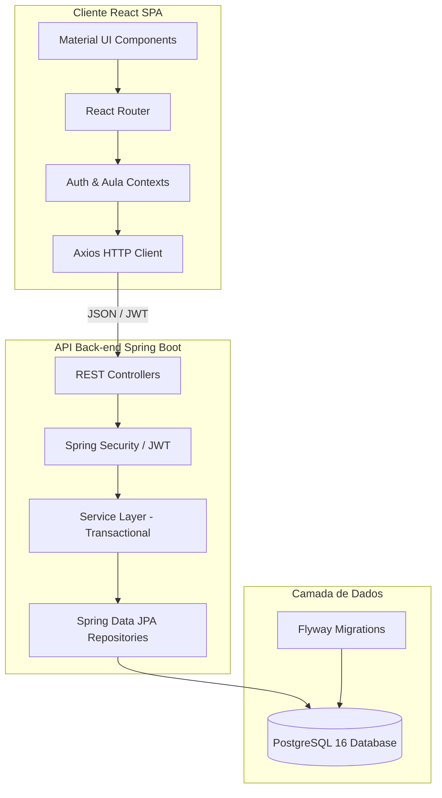
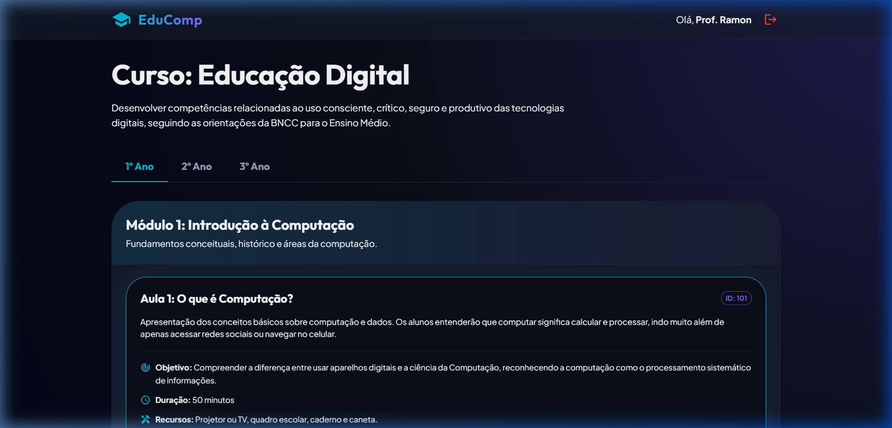
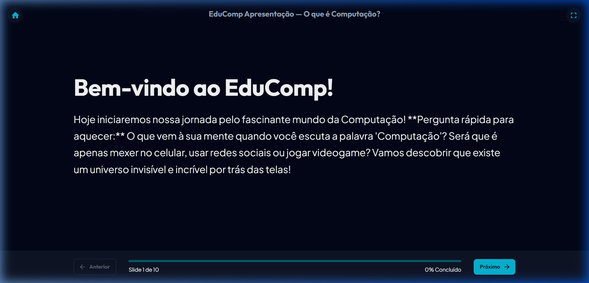
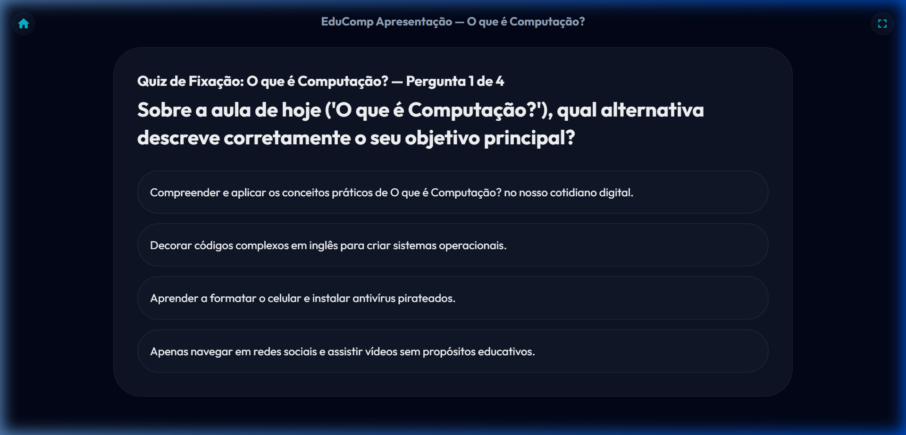
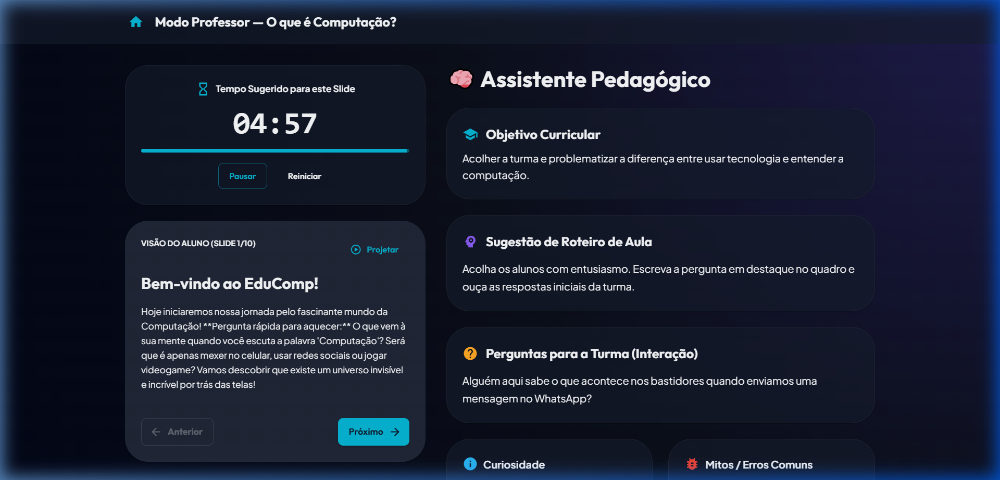

# RELATÓRIO DE ESTÁGIO SUPERVISIONADO III
## DESENVOLVIMENTO DE MATERIAL INSTRUCIONAL DIGITAL PARA APOIO AO ENSINO DE COMPUTAÇÃO

**Estagiário:** [Seu Nome Completo]  
**Matrícula:** [Sua Matrícula]  
**Orientador(a):** [Nome do(a) Orientador(a)]  
**Instituição:** Universidade Federal da Paraíba (UFPB) — Campus IV  
**Curso:** [Seu Curso - ex: Licenciatura em Computação / Sistemas de Informação]  
**Período de Realização:** [Mês/Ano de início] a [Mês/Ano de término] (ex: Março de 2026 a Julho de 2026)  

---

## 1. INTRODUÇÃO

### 1.1 Contextualização
Com a homologação das novas diretrizes da Base Nacional Comum Curricular (BNCC), o ensino de Computação passou a figurar como um elemento obrigatório na formação básica do Ensino Médio, ramificado em eixos conceituais como Pensamento Computacional, Mundo Digital e Cultura Digital. Entretanto, a realidade das escolas públicas de ensino médio no Brasil impõe barreiras severas para a consolidação desse currículo. A maioria das instituições escolares de rede pública apresenta infraestrutura de informática altamente deficiente: computadores obsoletos, falta de conexão estável de internet nos laboratórios de informática, ou mesmo a completa ausência desses espaços. 

Adicionalmente, verifica-se uma lacuna pedagógica: muitos dos professores responsáveis por ministrar os conceitos de computação não possuem formação específica na área tecnológica (sendo majoritariamente formados em Matemática, Física ou outras licenciaturas), o que gera insegurança na preparação e na condução das aulas sobre conteúdos técnicos.

### 1.2 Objetivo
O objetivo geral deste estágio consistiu no desenvolvimento de uma plataforma digital interativa e pedagógica denominada **EduComp**. O projeto atua como um material instrucional projetado especificamente para apoiar o professor do Ensino Médio na condução de suas aulas de Computação. A solução busca viabilizar aulas de alto nível conceitual em ambientes convencionais de ensino, demandando exclusivamente uma televisão ou projetor na sala de aula. O EduComp integra, em uma única aplicação web, apresentações visuais de slides para os alunos e um **Assistente Pedagógico** embarcado em tempo real para orientar o professor.

---

## 2. DESENVOLVIMENTO

### 2.1 Descrição do Material Instrucional
O **EduComp** é um ecossistema digital composto por uma interface administrativa de gestão e uma aplicação de apresentação síncrona com dupla visualização:
1. **Modo Apresentação (Visão do Aluno):** Uma interface limpa, de alto contraste visual (tema escuro otimizado para projeção) e livre de distrações, exibida na TV ou projetor da sala de aula, contendo slides informativos, ilustrações conceituais e quizzes interativos de fixação.
2. **Modo Professor (Assistente Pedagógico):** Uma tela de suporte que roda paralelamente no dispositivo móvel (smartphone, tablet) ou notebook do professor. Este modo exibe o slide atual projetado aos alunos em tamanho reduzido e disponibiliza um roteiro didático sob demanda contendo objetivos específicos da etapa, tempo estimado de fala, sugestão de explicação, perguntas reflexivas para instigar a turma com as respostas conceituais esperadas, curiosidades sobre o tema e alertas contra erros conceituais comuns (mitos tecnológicos).

### 2.2 Justificativa
A criação do EduComp justifica-se como resposta prática às limitações estruturais e de formação pedagógica presentes nas escolas públicas de educação básica. Ao invés de demandar que cada estudante possua um computador para praticar programação e conceitos digitais, a plataforma centraliza a entrega do conteúdo através de metodologias ativas que o professor pode mediar com um único projetor. O Assistente Pedagógico atua como um tutor e plano de aula contínuo, mitigando a falta de formação técnica especializada do corpo docente ao fornecer fundamentação instantânea sobre os conceitos ministrados, permitindo que professores de qualquer formação sintam-se seguros ao abordar tópicos avançados como algoritmos, segurança de redes e inteligência artificial.

### 2.3 Escopo do Material Instrucional
O escopo desenvolvido para a etapa de Estágio III englobou:
* **Modelagem Curricular Completa:** Planejamento e estruturação de um currículo de Computação de 3 anos para o Ensino Médio integrado com as competências da BNCC (contendo 24 semanas letivas divididas em eixos temáticos como Introdução à Computação, Conhecendo o Computador, Redes e Internet, Pensamento Computacional, Linguagens de Programação e Tecnologias Emergentes).
* **Desenvolvimento da Arquitetura do Sistema:** Criação do banco de dados relacional e serviços do back-end para gerenciar cursos, séries, módulos, aulas, slides e quizzes.
* **Criação do Front-end Interativo:** Implementação da Single Page Application contendo o catálogo de módulos, a visualização dos slides otimizada e o painel de suporte do professor com cronômetro em tempo real para controle do tempo de aula.

*Nota de Escopo:* A funcionalidade de autoria de materiais (permitindo que o professor adicione, edite ou exclua seus próprios slides e atividades diretamente pelo painel administrativo da web) foi mapeada e planejada conceitualmente durante este estágio, mas sua implementação prática de CRUD completo de arquivos foi delimitada como a principal meta de continuidade para as atividades de desenvolvimento do **Estágio IV**.

### 2.4 Público-alvo
* **Professores do Ensino Médio de Escolas Públicas:** Usuários principais que necessitam de materiais pedagógicos estruturados, planos de aula claros e guias conceituais para ministrar o currículo obrigatório de computação.
* **Estudantes do Ensino Médio:** Receptores do material que se beneficiam de apresentações dinâmicas, dinâmicas conceituais e quizzes para consolidação do conhecimento em tecnologia.

### 2.5 Funcionalidades Desenvolvidas
As principais funcionalidades implementadas e integradas no material instrucional EduComp são:
1. **Controle de Acesso e Autenticação (JWT):** Login seguro para os docentes, garantindo privacidade e integridade das sessões pedagógicas.
2. **Navegação do Currículo (Catálogo):** Listagem e organização de cursos por Série Escolar (1º, 2º e 3º ano) e Módulos de Aprendizado.
3. **Modo Apresentação de Slides (Aluno):** Interface de reprodução de slides com suporte a navegação por teclado (setas direcionais), exibição de textos formatados e transições fluidas.
4. **Modo Professor (Assistente Pedagógico):** Painel dinâmico sincronizado ao slide atual com:
   * **Objetivos Curriculares e Habilidades BNCC** trabalhadas (ex: CG2, CG5, EM13LGG701).
   * **Cronômetro regressivo inteligente** com tempo sugerido de explicação para evitar que o docente se disperse.
   * **Instruções de Mediação:** Roteiro claro sobre como explicar os diagramas e textos do slide.
   * **Caixa de Diálogo e Perguntas:** Perguntas estruturadas para guiar debates e respectivas respostas dos alunos.
   * **Guia de Erros Comuns e Curiosidades:** Auxílio para desmistificar preconceitos de hardware/software comuns.
5. **Módulo de Quizzes de Fixação:** Perguntas integradas ao término da aula para resposta em grupo com feedback instantâneo de acerto e erro direto na tela do projetor.
6. **Módulo de Atividades Práticas:** Seção de acesso e links rápidos para download de materiais complementares (atividades desplugadas, roteiros de dinâmicas).

### 2.6 Recursos Utilizados
Para assegurar a escalabilidade, manutenibilidade e qualidade visual de nível profissional do material instrucional, a plataforma foi desenvolvida utilizando modernas tecnologias de desenvolvimento de software em camadas:



* **Tecnologias de Front-end:**
  * **React JS + TypeScript:** Engenharia de componentes com tipagem estática que previne erros em tempo de execução.
  * **Material UI (MUI):** Framework de design que garantiu uma estética premium com paleta de cores personalizada, contraste otimizado para projeção (Dark Mode) e responsividade para dispositivos móveis.
  * **React Router:** Roteamento do cliente SPA.
  * **Axios:** Cliente HTTP para comunicação assíncrona com o back-end.

* **Tecnologias de Back-end:**
  * **Java 21 e Spring Boot 3.4.5:** Linguagem robusta com recursos modernos e framework de mercado para desenvolvimento de APIs corporativas estáveis.
  * **Spring Security + JWT:** Proteção de endpoints e autenticação sem estado (stateless) via Token de segurança no cabeçalho HTTP.
  * **Spring Data JPA + Hibernate:** Mapeamento objeto-relacional estruturando as tabelas do banco de dados em classes Java.
  * **Flyway Migration:** Gerenciador de migração de banco de dados para versionamento estrutural do PostgreSQL.
  * **PostgreSQL 16:** Banco de dados relacional robusto e estável para persistência das entidades curriculares.

---

## 3. RESULTADOS

A plataforma **EduComp** foi concluída em seu escopo de Estágio III como um protótipo funcional e integrado de ponta a ponta. Os principais resultados visuais e funcionais obtidos estão detalhados através do design e comportamento das principais telas de suporte à aprendizagem descritas a seguir:

### 3.1 Design da Interface e Fluxos de Navegação

Abaixo está o registro da estrutura visual e experiência interativa desenvolvida para apoiar as aulas de computação:

````carousel

<!-- slide -->

<!-- slide -->

<!-- slide -->

````

### 3.2 Alinhamento Curricular Obtido
Além do software funcional, o principal resultado gerado pelo estágio foi o mapeamento curricular e a geração dos conteúdos do curso piloto de **Educação Digital**. Toda a estrutura de aulas no banco de dados está diretamente amarrada com códigos da BNCC e as seguintes premissas práticas:
* **Aulas com Roteiros "Desplugados":** Atividades práticas simulando o processamento do computador e a comunicação de redes por meio de cartões de papel e representação física na sala, garantindo que o aprendizado ocorra mesmo sem equipamentos individuais.
* **Mapeamento Curricular dos Três Anos:** 
  * *1º Ano (Fundamentos):* Introdução à Computação, Conhecendo o Computador (Hardware/Software), Redes e Internet, e Segurança Digital.
  * *2º Ano (Resolução de Problemas):* Pensamento Computacional, Lógica e Introdução aos Algoritmos de forma visual.
  * *3º Ano (Sociedade e IA):* Banco de Dados no cotidiano, Inteligência Artificial, Ética na Tecnologia e Tecnologias Emergentes.

---

## 4. CONSIDERAÇÕES FINAIS

### 4.1 Resultados Obtidos
O desenvolvimento da plataforma EduComp durante o Estágio Supervisionado III alcançou com êxito os objetivos propostos. Foi desenvolvida uma arquitetura moderna, robusta e modularizada que garante a integração entre a base de dados relacional (gerenciando as aulas e objetivos pedagógicos da BNCC) e a interface visual rica. O sistema provou que é viável fornecer suporte pedagógico avançado de forma integrada à apresentação visual, reduzindo a carga cognitiva do professor no planejamento e fornecendo a ele maior segurança didática no momento da exposição do conteúdo de Computação.

### 4.2 Dificuldades Encontradas
Entre as principais dificuldades enfrentadas durante o desenvolvimento do sistema, destacam-se:
1. **Estruturação Curricular vs. Linguagem Simples:** O desafio pedagógico de traduzir termos complexos da computação (como portas lógicas, barramentos de memória e protocolos de roteamento de redes) em metáforas e analogias simplificadas que professores sem treinamento técnico em informática pudessem compreender e explicar com clareza a adolescentes do Ensino Médio.
2. **Experiência Multidispositivos Responsiva (UX):** Projetar o comportamento do front-end com duas visões síncronas que operam de formas muito distintas: o Modo Aluno necessita de fontes maximizadas com contraste extremo para ser visualizado a metros de distância em uma TV comum, enquanto o Modo Professor exige uma densidade de informações em formato de roteiro (texto denso e botões de ação rápidos) em telas compactas de celulares, exigindo ajustes minuciosos de flexibilidade e layout com Material UI.

### 4.3 Limitações
A principal limitação da versão desenvolvida no Estágio III é a **falta de autoria dinâmica por parte dos professores**. Atualmente, o cadastro de aulas, slides e roteiros do assistente pedagógico é feito via banco de dados pelos administradores ou de forma estática nas estruturas de dados simulações da aplicação. O professor tem o papel de usuário-consumidor do material pronto, não conseguindo alterar o conteúdo dos slides ou criar slides personalizados a partir do seu próprio material no formato de arquivos locais (PDF, PowerPoint) diretamente pela plataforma.

### 4.4 Reflexões e Próximos Passos (Estágio IV)
O Estágio Supervisionado III permitiu vivenciar de forma completa os processos de Engenharia de Software aplicados à Educação Computacional. A criação de material instrucional digital no EduComp demonstrou que o desenvolvimento tecnológico de sistemas corporativos pode gerar soluções diretas de impacto social, superando a escassez de infraestrutura de hardware nas escolas básicas através de um design inteligente centrado na mediação docente.

Como continuidade e meta para o **Estágio Supervisionado IV**, pretende-se:
* **Desenvolver o Módulo de Autoria do Professor:** Criar a interface administrativa visual que permita aos docentes criarem seus próprios módulos, customizarem os slides de apoio e inserirem suas atividades práticas personalizadas, possibilitando o upload de materiais em PDF/Imagens.
* **Sincronização em Tempo Real via WebSockets:** Desenvolver a sincronização ativa de estado entre dispositivos de modo que, ao avançar o slide no smartphone (Modo Professor), a tela da TV (Modo Apresentação) seja atualizada automaticamente sem necessidade de controle físico direto no computador conectado à TV.
* **Validação em Ambiente Escolar:** Realizar testes de usabilidade e aplicação piloto em salas de aula de escolas públicas da região do Litoral Norte da Paraíba para coleta de feedbacks reais de docentes e estudantes.
